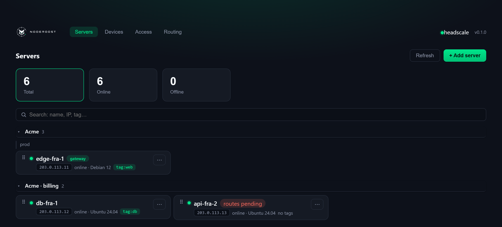
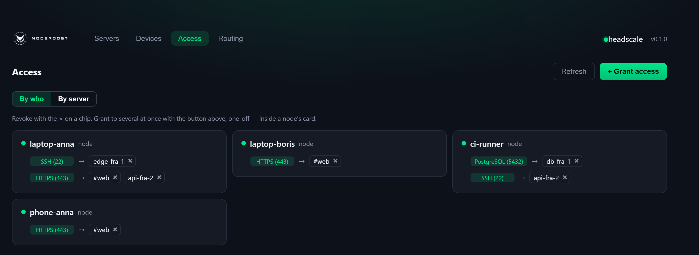
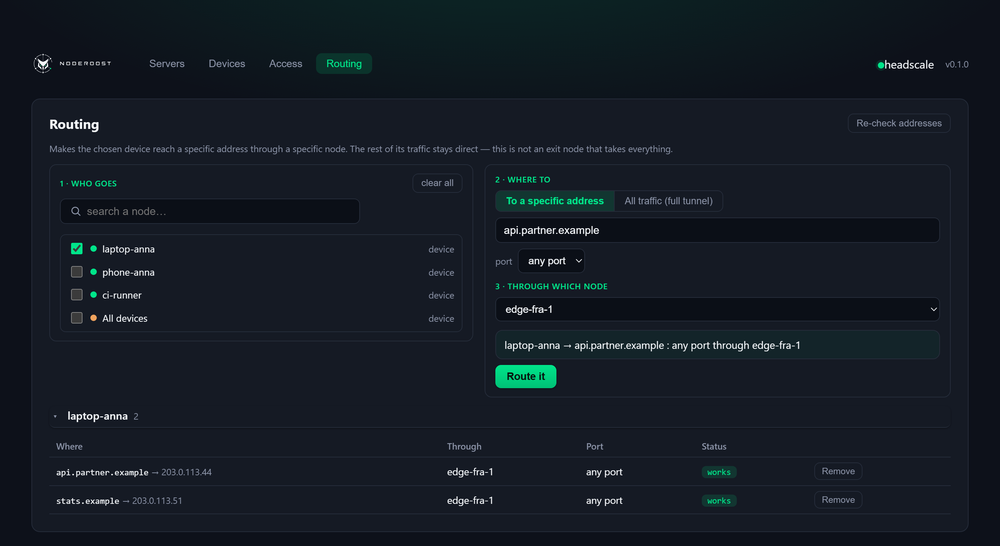
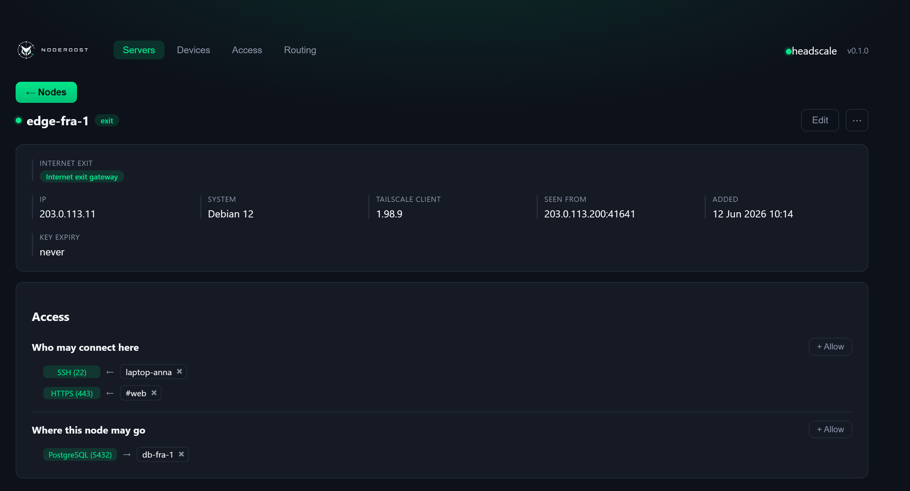
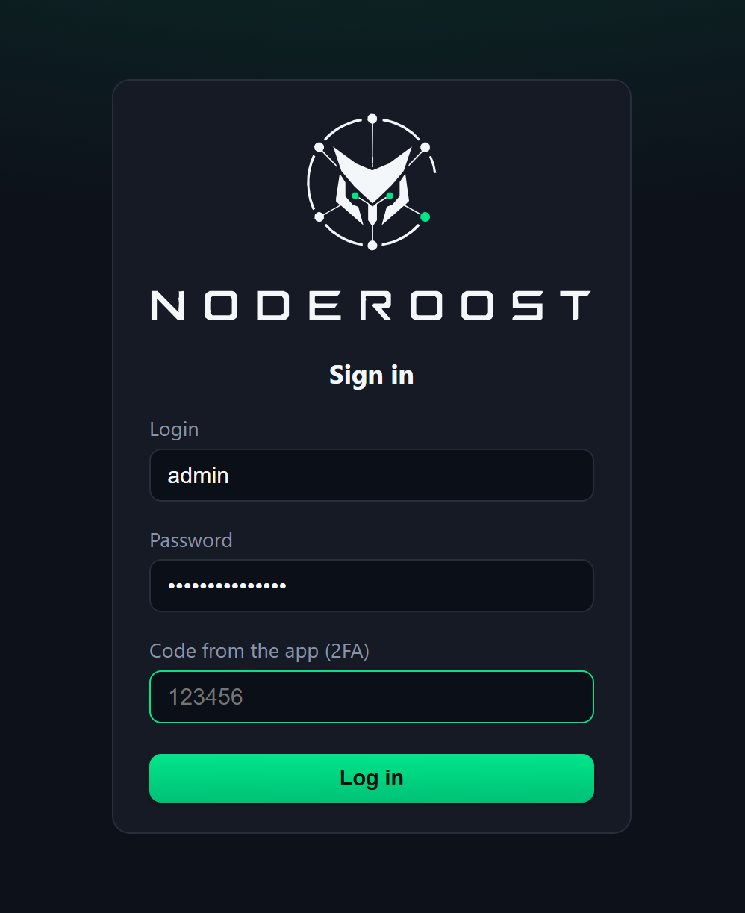

# NodeRoost

A self-hosted web panel for [headscale](https://github.com/juanfont/headscale) —
the open-source implementation of the Tailscale coordination server.

Your own Tailscale control server, with a real admin panel. Add a machine, grant
access, send traffic through a chosen node — no editing `policy.hujson`, no SSH
into nodes. The panel does not replace headscale and does not proxy traffic: it
takes over the part that is otherwise done by hand.

[Русская версия](README.ru.md) · [Why and what for](docs/why.md) · [Changelog](CHANGELOG.md) · [noderoost.ru](https://noderoost.ru)



<table>
<tr>
<td width="50%"><a href="docs/screenshots/access.png"></a><br><sub>Access — who reaches which server, on which port</sub></td>
<td width="50%"><a href="docs/screenshots/routing.png"></a><br><sub>Routing — who goes where, through which node</sub></td>
</tr>
<tr>
<td width="50%"><a href="docs/screenshots/node.png"></a><br><sub>Server detail — roles, subnets, exit gateway, agent</sub></td>
<td width="50%"><a href="docs/screenshots/login.png"></a><br><sub>Sign-in — password and a second factor</sub></td>
</tr>
</table>

<sub>Screens are rendered from the panel's own stylesheet with example data; the
addresses are documentation ranges (RFC 5737), not a live tailnet.</sub>

---

## Why a panel when headscale already works

The panel does not replace headscale and does not carry your traffic. It takes over
the part that is otherwise done by hand: granting access becomes a *who → where → on
which port* rule instead of an edit to `policy.hujson`; a subnet behind a node is a
button instead of `approve-routes` by node id; a route is applied by an agent instead
of an SSH session on every machine.

What people build with it — two office LANs seeing each other without a public address
anywhere, a work machine reachable from behind someone else's NAT, a database open to
a contractor on one port and nothing else, a laptop leaving for the internet through a
server whose address a partner allows. **[Reasons, goals and the full set of
scenarios → docs/why.md](docs/why.md)**

## What it does

**Servers and devices.** Nodes split into servers (things you connect *to*) and
personal devices. Devices are isolated from one another and can never be a rule's
target — enforced in the policy engine, not in the UI, because a rule can also
arrive through the API.

**Grants, not an ACL file.** A rule is *who → where → on which port*. Grant it by
clicking, to several nodes at once, or from inside a node's own page. The HuJSON is
generated, pushed, and rolled back if headscale refuses it.

**Roles.** A role is a group of servers (a headscale tag). Grant access to the
role; adding a server to it later needs no rule changes.


**Routing.** Directions — *these nodes reach that address through this node*. Give a
hostname and the panel resolves it, keeps the route in sync when the site moves, and
refuses addresses that would hijack traffic inside the mesh.

**Names inside the network.** A service behind an address allowlist — or with no
ports open to the world at all — is reached by the name it already has: the panel
hands the nodes a *name → address on the network* record. Public DNS is left alone,
so from outside the name leads where it always did. The address is not remembered
but taken from the node, so a node reconnecting does not break the record.

**Certificates for those names.** Each name has a padlock tick: the panel orders a
Let's Encrypt certificate while the key is generated on the node itself and never
leaves it — only a request to sign goes up. One DNS record is needed, once (the mask
of your internal names pointing at the panel): no DNS-provider API keys, no proxy
plugins. Renewal takes care of itself.

**Internet egress through gateways.** Mark a server as an exit gateway and pick
which devices may use it. In the Tailscale tray each user sees only the exits you
allowed — the choice is theirs, the set is yours. A node's whole outbound traffic can
also be forced through a gateway while the node stays reachable on its public IP.

**An agent on the node.** headscale can approve routes but has no channel to *tell* a
node what to advertise, so NodeRoost ships a small POSIX-sh agent: a systemd timer
pulls the desired state, applies it with `tailscale set`, and reports the hash of
what it actually applied.

**Where a server sits.** A country flag next to the node name, resolved from the
node's public address **offline** against a table in the repository: no need to
send every address in your fleet to a geo service for the sake of a flag, and no
internet required. The node's name plays no part in it.

**Backups, monitoring, alerts.** Consistent snapshots of the headscale database and
panel settings with a self-test and a rehearsed restore; uptime history; Telegram or
webhook alerts for a downed server or an expiring key; and an independent host
watchdog for when the panel itself goes quiet.

## Security

The panel runs a VPN network, so the guarantees live in code and are covered by
tests:

- devices never reach each other, and a device is never a rule's destination —
  not by picking it from a list, not by typing its tailnet address by hand;
- a node cannot promote itself: its class and its tags follow only what the
  administrator approved, never what the node announces about itself;
- tags are owned by an empty group, so no node can apply one to itself;
- sign-in is JWT + optional TOTP with attempt limits and an audit log; the panel
  refuses to start with a weak secret or the default password;
- releases build from a hash-verified dependency lock, with base images pinned by
  digest.

Deployment notes that matter — network isolation, what is exposed publicly — are in
[SECURITY.md](SECURITY.md). Read it before putting this on the internet.

## Requirements

- Docker with Compose
- a reverse proxy terminating TLS (the compose overlay ships
  [caddy-docker-proxy](https://github.com/lucaslorentz/caddy-docker-proxy) labels;
  give NodeRoost a network of its own — see SECURITY.md)
- two DNS names: one for the panel, one public one for the control server

## Quick start

**Full guide:** [docs/install.md](docs/install.md) — one-command install, your own
domain, the address allowlist, the firewall and what to do when something is wrong.

```bash
git clone https://github.com/mihsergeev/NodeRoost.git
cd NodeRoost
cp .env.example .env
```

Fill in `.env` — at minimum a random `NODEROOST_JWT_SECRET` (`openssl rand -hex 32`),
a strong `NODEROOST_ADMIN_PASSWORD`, `NODEROOST_DB_PASSWORD`, your two domains and
the addresses allowed to reach the panel. Then put the headscale config in place:

```bash
mkdir -p data/headscale/config
cp deploy/headscale/config.example.yaml data/headscale/config/config.yaml
$EDITOR data/headscale/config/config.yaml   # server_url, base_domain, prefixes
docker compose up -d
```

The backend needs a headscale API key, which can only be created once headscale is
running:

```bash
docker compose exec headscale headscale apikeys create --expiration 999d
# put it in .env as NODEROOST_HEADSCALE_API_KEY, then:
docker compose up -d backend
```

Sign in with the admin credentials from `.env` and add your first node — the panel
hands you a one-time key and a ready-made command for Linux, Windows, macOS or
Android.

## Architecture

```
            ┌───────── public ──────────┐      ┌──── allow-listed ────┐
 nodes ───► │ hs.example.com            │      │ panel.example.com    │
            │ headscale, node endpoints │      │ SPA + panel API      │
            │ only (/api/v1 → 404)      │      └──────────┬───────────┘
            └──────────┬────────────────┘                 │
                       │    internal docker network       │
                       └─────────► headscale API ◄────────┘
```

The panel reaches headscale's management API only over the internal network; on the
public vhost `/api/v1` and `/swagger` return 404, leaving the node-facing endpoints.
Panel state lives in Postgres, headscale keeps its own SQLite.

## Development

```bash
cd backend  && python -m venv .venv && .venv/bin/pip install -e . && pytest
cd frontend && npm install && npm run dev
```

The country flag next to a node is resolved from its public address **offline** — none of your fleet's addresses leave the host. The table (`backend/app/data/geoip.csv.gz`, DB-IP IP-to-Country Lite, CC BY 4.0) ships in the repository; refresh it every few months:

```bash
python ops/build-geoip.py
```

## License

BSD-3-Clause — see [LICENSE](LICENSE).
