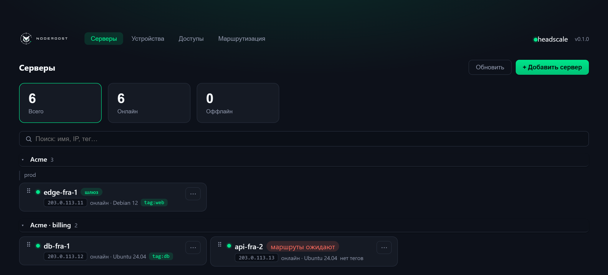
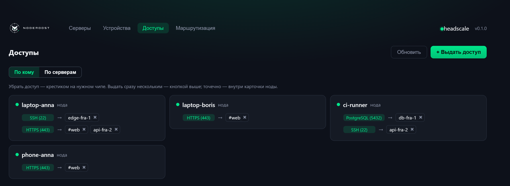
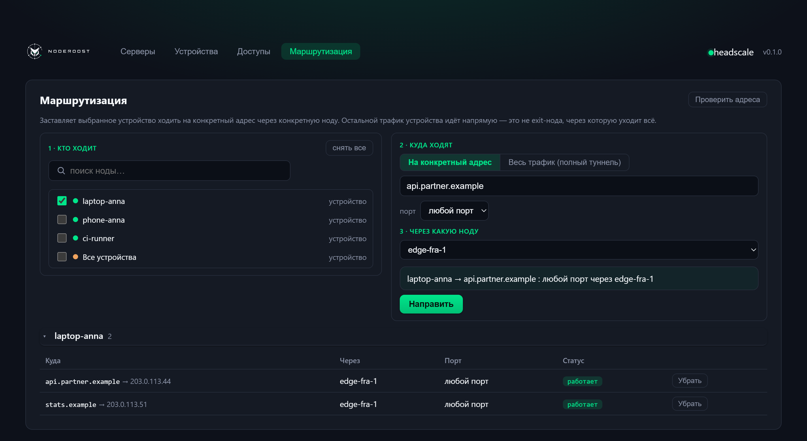
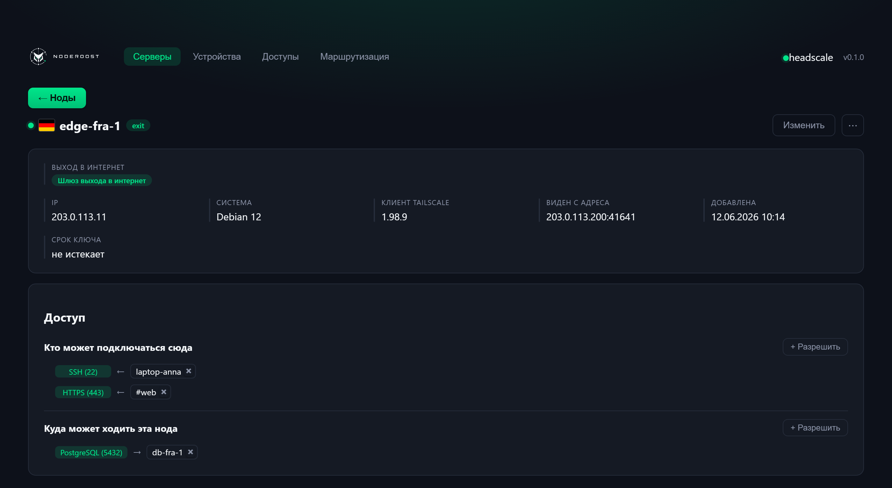
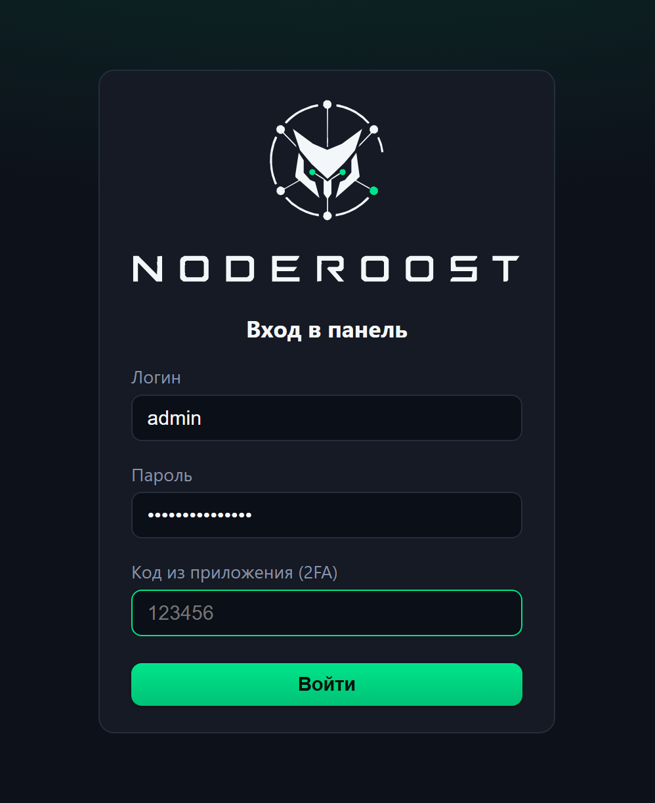

# NodeRoost

Self-hosted веб-панель для [headscale](https://github.com/juanfont/headscale) —
open-source реализации координационного сервера Tailscale.

Свой control-сервер Tailscale — и нормальная админка к нему. Подключить машину,
выдать доступ, пустить трафик через нужный узел — без правки `policy.hujson`
и SSH на ноды. Панель не заменяет headscale и не проксирует трафик: она берёт
на себя то, что иначе делается руками.

[English version](README.md) · [Зачем и для чего](docs/why.ru.md) · [История изменений](CHANGELOG.ru.md) · [noderoost.ru](https://noderoost.ru)



<table>
<tr>
<td width="50%"><a href="docs/screenshots/ru/access.png"></a><br><sub>Доступы — кто до какого сервера и по какому порту</sub></td>
<td width="50%"><a href="docs/screenshots/ru/routing.png"></a><br><sub>Маршрутизация — кто куда ходит и через какую ноду</sub></td>
</tr>
<tr>
<td width="50%"><a href="docs/screenshots/ru/node.png"></a><br><sub>Карточка сервера — роли, подсети, шлюз выхода, агент</sub></td>
<td width="50%"><a href="docs/screenshots/ru/login.png"></a><br><sub>Вход — пароль и второй фактор</sub></td>
</tr>
</table>

<sub>Экраны отрисованы стилями самой панели на примерных данных; адреса —
документационные (RFC 5737), это не живой тайлнет.</sub>

---

## Зачем панель, если headscale и так работает

Панель не заменяет headscale и не пропускает через себя трафик. Она берёт на себя ту
часть, которую иначе делают руками: выдать доступ — это правило «кто → куда → по
какому порту», а не правка `policy.hujson`; подсеть за нодой — кнопка, а не
`approve-routes` по номеру ноды; маршрут применяет агент, а не вы по SSH на каждой
машине.

Что на этом строят — две локалки офиса, которые видят сети друг друга без белого
адреса, рабочая машина за чужим NAT, база, открытая подрядчику на один порт и больше
ни на что, ноутбук, выходящий в интернет через сервер, чей адрес разрешён у партнёра.
**[Причины, цели и все сценарии → docs/why.ru.md](docs/why.ru.md)**

## Что она делает

**Серверы и устройства.** Ноды разделены на серверы (то, *куда* ходят) и личные
устройства. Устройства изолированы друг от друга и никогда не бывают целью
правила — это держится в движке политики, а не в интерфейсе, потому что правило
может прийти и через API.

**Доступы, а не ACL-файл.** Правило — это *кто → куда → по какому порту*. Выдаётся
мышью, сразу нескольким нодам или прямо из карточки ноды. HuJSON панель собирает
сама, пушит в headscale и откатывает, если тот его отверг.

**Роли.** Роль — группа серверов (тег headscale). Доступ выдаётся на роль: добавили
в неё сервер — правила менять не нужно.


**Маршрутизация.** Направления — *эти ноды ходят на такой-то адрес через такую-то
ноду*. Дайте имя хоста: панель сама его резолвит, обновляет маршрут, если сайт
переехал, и отклоняет адреса, которыми можно было бы перехватить трафик внутри
меша.

**Выход в интернет через шлюзы.** Пометьте сервер шлюзом и укажите, каким
устройствам он разрешён. В трее Tailscale пользователь видит только разрешённые
ему выходы — выбор за ним, набор за вами. Весь исходящий трафик ноды можно
принудительно завернуть в шлюз, оставив её доступной по публичному IP.

**Агент на ноде.** headscale умеет одобрять маршруты, но не умеет *сказать* ноде,
что анонсировать. Поэтому в комплекте небольшой агент на POSIX sh: systemd-таймер
забирает желаемое состояние, применяет его через `tailscale set` и отчитывается
хешем того, что действительно применил.

**Где стоит сервер.** Рядом с именем ноды — флаг страны. Он определяется по
внешнему адресу ноды **офлайн**, по таблице в репозитории: отправлять адреса
всего парка во внешний geo-сервис ради флажка не нужно, да и интернет для этого
не требуется. Имя ноды в определении не участвует.

**Бэкапы, мониторинг, алерты.** Консистентные снимки базы headscale и настроек
панели с самопроверкой и отработанным восстановлением; история онлайна; алерты в
Telegram или на вебхук при падении сервера и истечении ключа; и независимый
хостовый watchdog на случай, если замолчит сама панель.

## Безопасность

Панель управляет VPN-сетью, поэтому гарантии живут в коде и покрыты тестами:

- устройства не видят друг друга, и устройство никогда не бывает целью правила —
  ни выбором в списке, ни вписыванием его tailnet-адреса руками;
- нода не повышает себе права: её класс и теги определяет только то, что
  подтвердил администратор, а не то, что нода объявляет о себе сама;
- владелец всех тегов — пустая группа, поэтому навесить тег себе нода не может;
- вход — JWT и опциональный TOTP, с ограничением попыток и журналом действий;
  панель не стартует со слабым секретом или дефолтным паролем;
- релиз собирается из зафиксированных зависимостей с проверкой хешей, базовые
  образы прибиты по дайджестам.

Про то, что важно при развёртывании — изоляцию сети и то, что торчит наружу, —
написано в [SECURITY.md](SECURITY.md). Прочтите до выкладывания в интернет.

## Требования

- Docker с Compose
- обратный прокси с TLS (в оверлее compose есть метки для
  [caddy-docker-proxy](https://github.com/lucaslorentz/caddy-docker-proxy);
  выделите панели отдельную сеть — см. SECURITY.md)
- два DNS-имени: одно для панели, одно публичное для control-сервера

## Быстрый старт

**Подробная инструкция:** [docs/install.ru.md](docs/install.ru.md) — установка одной
командой, свой домен, список доверенных адресов, фаервол и разбор частых проблем.

```bash
git clone https://github.com/mihsergeev/NodeRoost.git
cd NodeRoost
cp .env.example .env
```

Заполните `.env` — как минимум случайный `NODEROOST_JWT_SECRET`
(`openssl rand -hex 32`), надёжный `NODEROOST_ADMIN_PASSWORD`,
`NODEROOST_DB_PASSWORD`, свои домены и адреса, которым разрешён доступ к панели.
Затем положите на место конфиг headscale:

```bash
mkdir -p data/headscale/config
cp deploy/headscale/config.example.yaml data/headscale/config/config.yaml
$EDITOR data/headscale/config/config.yaml   # server_url, base_domain, prefixes
docker compose up -d
```

Бэкенду нужен API-ключ headscale, а создать его можно только когда headscale уже
запущен:

```bash
docker compose exec headscale headscale apikeys create --expiration 999d
# впишите его в .env как NODEROOST_HEADSCALE_API_KEY, затем:
docker compose up -d backend
```

Войдите под учёткой администратора из `.env` и добавьте первую ноду — панель
выдаст одноразовый ключ и готовую команду под Linux, Windows, macOS или Android.

## Как устроено

```
            ┌───────── публично ────────┐      ┌─── за вайтлистом ────┐
 ноды ────► │ hs.example.com            │      │ panel.example.com    │
            │ headscale, только узловые │      │ SPA + API панели     │
            │ эндпоинты (/api/v1 → 404) │      └──────────┬───────────┘
            └──────────┬────────────────┘                 │
                       │   внутренняя сеть docker         │
                       └─────────► API headscale ◄────────┘
```

К управляющему API headscale панель ходит только по внутренней сети; на публичном
vhost `/api/v1` и `/swagger` отдают 404, наружу остаётся узловой контур. Состояние
панели — в Postgres, у headscale своя SQLite.

## Разработка

```bash
cd backend  && python -m venv .venv && .venv/bin/pip install -e . && pytest
cd frontend && npm install && npm run dev
```

Флаг страны рядом с нодой панель определяет по её внешнему адресу **офлайн** — никакие адреса вашего парка наружу не уходят. Таблица (`backend/app/data/geoip.csv.gz`, DB-IP IP-to-Country Lite, CC BY 4.0) лежит в репозитории; обновить раз в несколько месяцев:

```bash
python ops/build-geoip.py
```

## Лицензия

BSD-3-Clause — см. [LICENSE](LICENSE).
